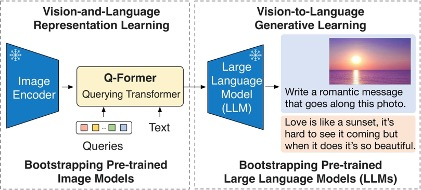
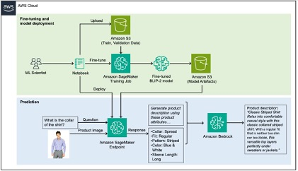

# Finetuning Models to perform domain-specific Visual Question Answering

## Generating fashion product descriptions by fine-tuning a Vision-Language Model (VLM) with Amazon SageMaker and Amazon Bedrock

This repository implements a machine learning training and inference regiment, using Generative AI (GenAI) to answer questions based on provided images. Pre-trained models exist to achive such tasks, however they are a) unable to adapt to domain-specific scenarios - hence why we need to fine tune and b) do not display the capability to be deployed into production environments.

To solve this problem, this post shows how to extract domain-specific product attributes from product images by fine-tuning a VLM (Vision-Language Model) on a fashion dataset using Amazon SageMaker, and then use Amazon Bedrock to generate product descriptions using the extracted attributes as input.

For a detailed walkthrough of this repository, please refer to our [blogpost](https://aws.amazon.com/blogs/machine-learning/generating-fashion-product-descriptions-by-fine-tuning-a-vision-language-model-with-sagemaker-and-amazon-bedrock).

## Data and Use case

The data used in this repository is taken from [Kaggle Fashion Images Dataset](https://www.kaggle.com/datasets/paramaggarwal/fashion-product-images-dataset) and the usecase we try to solve is  generating captions for these fashion products for an e-commerce website, a task that has historically been very time consuming. High-quality product descriptions improve searchability through Search Engine Optimization (SEO), as well as increase customer satisfaction by allowing them to make informed decisions.

## Vision-Language Model

The model finetuned in this repository is the [BLIP-2 Model](https://arxiv.org/abs/2301.12597) and more specifically, a variant of it using [Flan-T5-XL](https://huggingface.co/Salesforce/blip2-flan-t5-xl).

The following diagram illustrates the overview of BLIP-2:

## Solution Overview

The solution can be broken down into two sections, marked green and blue in the achitecture below: a) fine-tuning in green and b) inference in blue.

### Fine-Tuning

1. The data is downloaded in an S3 bucket
2. A subset of the data is used to fine-tune a model, using a Sagemaker Training Job
3. The fine-tuned model artefacts are then stored in an S3 bucket to be used for inference

### Inference

1. The model artefacts on S3 are spin up via a Sagemaker Endpoint
2. The Endpoint is then invoked with a question and returns a json-like response containing the relevant product attributes
3. The response is then passed to Amazon Bedrock alongside with a pre-defined prompt, which formats the response before returning it.

## Security

See [CONTRIBUTING](CONTRIBUTING.md#security-issue-notifications) for more information.

## License

This library is licensed under the MIT-0 License. See the LICENSE file.
